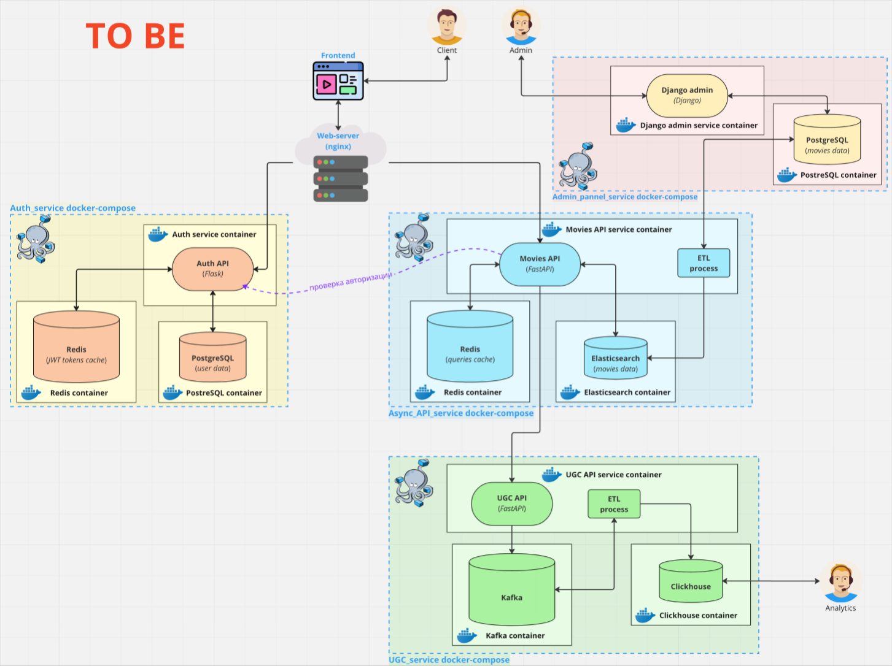

# Проектная работа 8 спринта
https://github.com/Nishela/UGC_service_team_2

## Основные сервисы 
#### UGC сервис:
    Принимает запросы от клиентов и сохраняет данные в Kafka.
#### ETL сервис:
    Отправляет данные из Kafka в CLickhouse.


# Инструкция по использованию

---
### Запуск:
1. Создаем файл `.env` на примере `.env.example`
2. Выполняем сборку и запуск проекта:
```shell
$ make run
```

### Пример запроса

Информация о прогрессе просмотра фильма для пользователя:
```shell
curl --location --request POST 'http://127.0.0.1:8000/ugc_service/v1/producer/send_event' \
--header 'Content-Type: application/json' \
--data-raw '{
  "event_name": "views",
  "user_id": "100",
  "data": {
    "movie_id": "123sf124",
    "value": "124251"
  }
}'
```


---
## Makefile функции: 

- собрать и сразу запустить проект
```shell
make run
```
- собрать и сразу запустить проект на машинах M1
```shell
make run_m1
```
- удалить все контейнеры
```shell
make delete
```
- просмотр логов UGC сервиса
```shell
make ugc_logs
```
- просмотр логов ETL сервиса
```shell
make elt_logs
```
---

### Схема TO BE: 

